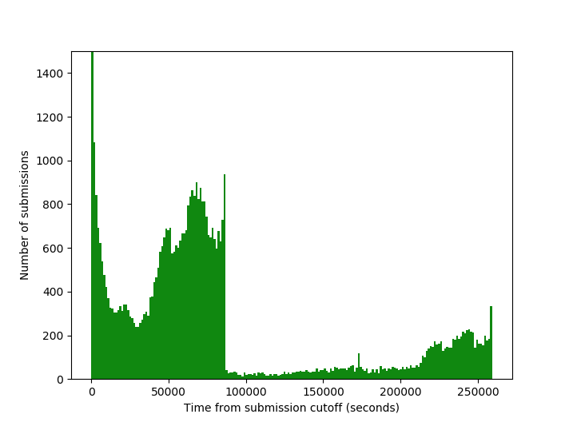
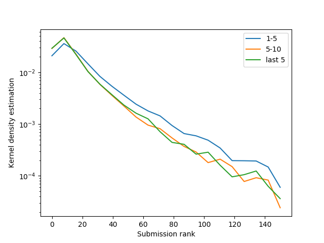
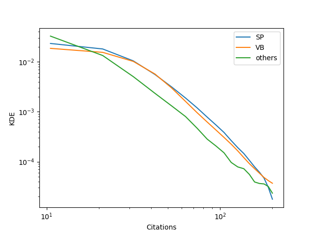
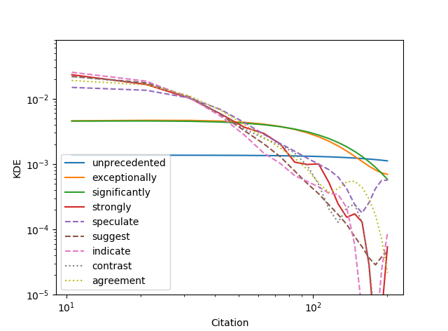
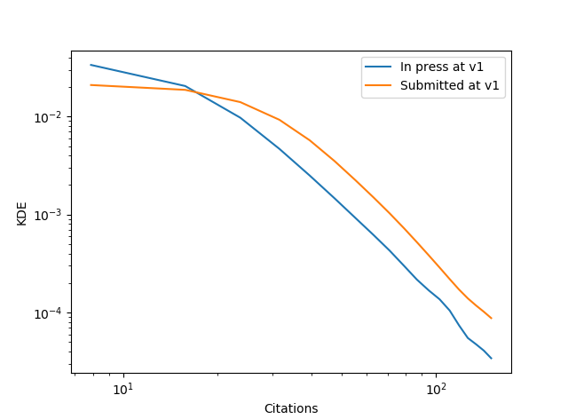
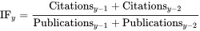
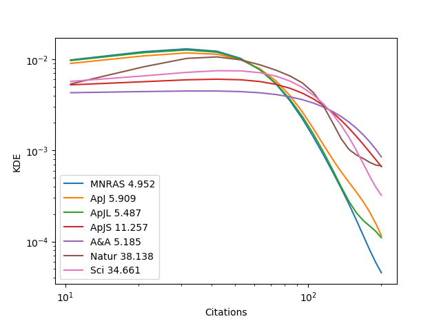

# The-irrational-side-of-science-an-analysis-of-the-citations-of-scientific-publications

This project aims at analyzing the scientific citations in [ArXiv](https://arxiv.org) and [ADS](http://adsabs.harvard.edu/abstract_service.html). In the title we use the word "irrational side of science" since we are interested in measuring factors which may impact the citation history of a paper beyond its intrinsic quality.

The code is written in Python. There are 3 routines:

* analysis.py: it is a program to perform all the analysis of the paper's database;

* ArXivRunner.py: the code to submit a paper on ArXiv at 14.00 EDT **sharp** to have the paper appear at the top on the general new preprints list;

* ArXivSpider.py: the code to crawl the [ArXiv](https://arxiv.org) and [ADS](http://adsabs.harvard.edu/abstract_service.html) server and build a database.

Goals:
* analyzing the trend of submissions of scientific papers on [ArXiv](https://arxiv.org) with respect to the cutoff submission date;
* assess whether there is a correlation between position of the publication in the daily digest of [ArXiv](https://arxiv.org) and the total number citations of a scientific paper from [ADS](http://adsabs.harvard.edu/abstract_service.html);
* assess whether there is a correlation between the choice of words used in the paper abstracts and the total number citations of a scientific paper;
* some nice/curios relations.
* Impact factor

# Overview
The [ArXiv](https://arxiv.org) repository currently contains over 500,000 documents. For over a decade, it
has been the primary means of access to the research literature in many fields of physics and
in some related fields. The arXiv corpus is divided
into different subject areas, with corresponding constituent sub communities, for example Astrophysics (astro-ph), math etc. Each of these
sub communities receives notifications each weekday of new articles received in the relevant
subject area, either by subscription to email announcements or by checking the web page
of newly received submissions in the relevant subject area, updated daily.

We crawled the ArXiv and ADS archives to fetch abstracts, title, authors and citation history of all the papers in Astrophysics published between 2013 and 2016.

 
# To get a feeling about submission time of scientific papers

Here we present the number of submitted papers in ArXiv vs. their submission time (seconds from cutoff submission time).

Note the spike in the first 10 minutes as some submitters jostle for top-ranked slots in the following days announcements. The daily queue begins with articles deposited after 4:00 pm each afternoon.

In the above Fig. we show the kernel density estimation of citations for each position ("early" is 1-5 ranks, and so on). "Not early" articles in the top few positions nonetheless receive more citations than those occupying lower list positions. 

We remember that the KDE is closely related to the probability for a paper to have a citation in a certain range. 

Note that effects of "self-promoted" (SP) articles (that authors can intuit in advance the quality of their articles and specifically aim to promote the better ones through early submission) from visibility bias (VB) (that is the initial higher visibility of being atop of the list translates to higher readership, and some fraction of that higher readership translates to higher citations later on) are entangled. Below we split "early" submission into two groups, papers submitted before and after 10 min from the cutoff submission time. The former corresponds to SP, while the latter to VB. 

Note that the two effects are comparable in terms of boosting of citations.

With VB there is a accidental forms of visibility can drive early readership, with consequent early citation potentially initiating a feedback loop to more readership and citation, ultimately leaving measurable and significant traces in the citation record.

In other words, early articles (1-5 in rank) found in the top position were cited more frequently than articles found lower in the queue.

However, Not-early articles found in the top position also received a similar, albeit much smaller, citation and full-text advantage compared to articles occupying lower list positions. This is so because they will appear a the top in  the "recent" (last 5 mailings) list.

# Bayesian Hierarchical modelling of citations 
Hierarchical or multilevel modeling is a generalization of regression modeling.

Hierarchical models are regression models in which the constituent model parameters are given probability models. This implies that model parameters are allowed to vary by group.

Observational units are often naturally clustered. Clustering induces dependence between observations, despite random sampling of clusters and random sampling within clusters.  In classical regression, this would result in collinearity. In a multilevel model, the partial pooling of the intercepts towards the expected value of the group-level linear model avoids this.

The general idea is that is to model citation  vs. rank position in the ArXiv listing via hierarchical linear regression, that is 

__log(cit+1)~$\alpha$*log(rank) + const__, 

where publications in days with similar number of listing would share same slope \alpha. __This methodology adds the benefits to properly account for the impact of different length of the daily digest from one day to another.__

We used the Theano library and a Student pdf (less prone to outliers) to perform hierarchical linear regression, and we __\alpha~-0.2__, confirming the intuition that the rank of the position in the daily listing affects the overall citations. As a rule of thumb -given a typical listing length - thi translates into about 20% of visibility factor between paper at the top vs. tail of the daily digest.

# Sentiment analysis of citations
Here we are interested in analyzing the overall abstracts published during the aforementioned periods (about 100,000 publication), to assess whether they correlate with the citations. We used the __spacy__ and __nltk__ libraries to build the tf_idf. The latter has been fitted via Lasso linear regression vs. the citation of each paper. The regularization parameter has been determined via cross-validation.

While many words correlate with the citations, they turn out to be confounding variables and simply related to an topics, for example Dark matter, which generates a lot of publications. By focusing on __adjective__ words only (via a tag analysis in NLTK), we can assess the impact of non-confounding variables on the citations.  

Here we build the KDE of some non-confounding words vs. citation. Note that words we express caution - suggest, speculate, indicate - leads to overall lower citations. Statistically, words with strong positive meaning - unprecedented, significantly , strongly - lead to higher citations.

Top words are selected via analysis of variance (__ANOVA__), where we compute whether there is a statistically significant relationship
between each feature and the target. Then the features that are related with the
highest confidence are selected. We further select only adjective words via nltk.

The use of these "stronger" words translates to higher readership - words with strong positive meaning catch the eyes of the reader in the ArXiv daily digest - and some fraction of that higher readership translates to higher citations later on.

By analyzing the whole papers via a custom document summarization algorithm on the entire body of the papers, we verified that the use of the "strong" words is somewhat subject, and they are truly non-confounding variables. For example, sentences like "... in sharp tension with...", "we disprove.", "...for the first time we proved" - while catching statistically the eyes of the readers, often do not correspond to a true breakthrough in science, nether to a major discrepancy with previous literature. With great power comes great responsibility, authors should wisely use this info to __honestly__ boost they paper's citation, but without __overselling__ their work.

Along a similar line, words we indicate "agreement" with respect to previous literature are catching less the eyes of readers less than words like "issues, disagreement, disprove, contrast". Readers are more interested in something novel rather than a confirmation of previous results.

# Post it before or after acceptance for publication?
It appears that papers posted on ArXiv before they are accepted for publication on the respective journal receive more citation than papers posted after they are accepted. 

One possible explanation is that the former paper collect more feedback from the scientific community, since are "in progress" and so comment can be easily incorporated.

# Analysis of impact factor
Impact factor is a metric (or better a number) for assessing citations that a journal receives. It is intended to reflect the yearly average number of citations to recent articles published in that journal. Journals with higher impact factors are often deemed to be more important than those with lower ones in a certain research field.

In any given year, the impact factor of a journal is the number of citations, received in that year, of articles published in that journal during the two preceding years, divided by the total number of articles published in that journal during the two preceding years:

We report impact factors on the above Figure in the legend. This number means that, on average, its papers published in 2014 and 2015 received roughly xxx citations each in 2016. Note that 2016 impact factors are reported in 2017 by the indexing agency (e.g. Web of Science).

It is interesting to make some comments about the below figure (Impact factor in 2015). First, we plot KDE of each major journal in Astrophysics vs. citation. Thus, impact factors would (roughly) represent the average value of citations of these bell-shaped curves. KDE is much richer of information than citation index. For example, a journal like Science has an impact factor of about 34, which may give you the impression that quality of publications is significantly higher than Astronomy and Astrophysics (IF~5). 

Looking at the full KDE rather than the impact factor (a single moment of the distribution) actually tell us that the high-tail of the KDE is higher for A&A than Science. That is, what is a "hot topic" in Astronomy is actually published more in A&A than Sci. The latter has a higher IF due to selection bias in publications, that is simply because lower quality and/or technical papers are not published at all in Sci, whereas in A&A a much broader spectrum of papers are accounted for.  

The comparison of our measured vs. published impact factor allows us also to assess the level of completeness of our database (~98%).

